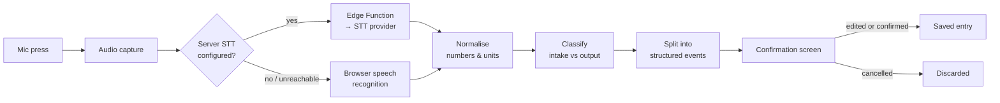

# FluidSense — App Plan

*App plan · internal · v2*

A mobile-first, voice-enabled fluid intake and output tracker for patients, carers and healthcare staff — built so recorded data is never mistaken for a precise measurement of someone's true fluid status.

**Status:** Core app — built · Backend & auth — pending
**Stack:** React · TypeScript · Vite

---

## 1. Principle — Never blur measured and guessed

The one rule everything else in the app is built around: an entry is exactly as certain as it actually is, and that certainty is visible everywhere — on the entry itself, in the daily total, and in a plain-language reliability rating (High / Moderate / Low) that explains its reasons rather than showing an opaque score.

Every intake or output event carries one of four statuses:

| Status | Meaning | Example |
|---|---|---|
| **Measured** | An exact volume was measured | 500 mL in a bottle |
| **Container-estimated** | A known container, a stated fraction | Half a known 300 mL mug |
| **Approximate** | A rough amount | "About one cup" |
| **Unmeasured** | An event happened, but no volume is known | Passed, but not measured |

The app is explicit that it never diagnoses: no dehydration, overload, or AKI language anywhere — only what was recorded, and how complete that record is.

## 2. Audience — Three people, one chart

Patient mode and healthcare mode share the same data model and calculation engine, so a nurse and a patient are always looking at the same underlying record — just through a view suited to the moment.

- **Patient / carer** — Large one-tap buttons, plain English, voice entry, and a simple last-24-hours view. Built for someone recording on a phone, possibly older or unwell.
- **Nurse / HCA** — Fast recording across a shift, who-recorded-what on every entry, and reminders that flag gaps without assuming nothing happened.
- **Clinician** — A multi-patient dashboard sortable by reliability, time-since-output, or balance direction — for reviewing, never for the app to conclude on its behalf.

## 3. Feature map

| Area | What it does |
|---|---|
| **Today** | Recorded balance for the active monitoring day, clinician-set fluid allowance (if any), quick-add buttons, and a live activity timeline. |
| **Voice entry** | Tap-to-record → transcribe → parse → confirm. Handles multiple events in one sentence, flags ambiguity ("was that intake or output?") instead of guessing, and never saves without confirmation. |
| **Manual entry** | Guided flows for every intake and output type, including saved personal containers and a learned drinks library. |
| **Summary** | Rolling 24h, monitoring day, shift, or custom range — each labeled explicitly so the three are never confused with each other. |
| **History** | Full audit log with filters, multi-select delete with a brief undo window, and a before/after trail on every edit. |
| **Healthcare dashboard** | All patients under one account, sortable by reliability, unmeasured-event count, or balance — each one opens into the same Today view. |
| **Data & monitoring settings** | Start a new day without losing history, clear just today, delete all fluid data, or reset the account entirely — five distinct, clearly-labeled actions, never one generic "reset." |
| **Onboarding & demo mode** | Real accounts start empty. A separate, clearly-labeled demo mode with fictional patients is available from the landing page and never touches real data. |

## 4. Voice pipeline — From speech to a confirmed entry

Audio is recorded only while actively speaking, sent to a server-side transcription function so no provider key ever ships to the browser, and discarded once transcribed. If no server is configured, the app falls back to the browser's built-in recognition automatically — voice entry never hard-depends on one provider.

## 5. Status — Built vs. remaining

| Area | Status | Note |
|---|---|---|
| Core screens & flows | ✅ Done | Today, manual entry, history, summary, dashboard, profile |
| Onboarding & demo isolation | ✅ Done | Real accounts start at zero; demo mode never mixes in |
| Monitoring periods | ✅ Done | Start-new-day, custom day-start time, clear-today, all tested |
| Voice parsing & confirmation | ✅ Done | 30 automated tests against the required phrase set |
| Data safety controls | ✅ Done | Clear today / delete all / reset account, each a distinct confirmed action |
| Database schema & server transcription | ✅ Done | Written and ready — Postgres schema with row-level security, plus the transcription proxy function |
| Backend connection & auth | ⏳ Pending | Needs a live Supabase project; app runs on local storage until then |
| Mobile Safari check | ⏳ Pending | Built to standard responsive CSS; not yet driven on a physical device |

## 6. Next steps

1. **Connect Supabase** — Provision the project, apply the existing schema, wire sign-up / sign-in / sign-out and per-user data isolation.
2. **Deploy the transcription function** — Ship the Edge Function with the speech-to-text provider key held server-side only.
3. **Device QA** — Run the full manual checklist on physical mobile Safari and Android Chrome.
4. **Deploy** — Static build to a hosting provider, environment variables set per-environment, no secrets committed.

---

*FluidSense is currently a prototype and must not be used as the sole basis for clinical decisions.*
*Internal planning document · reflects the codebase as of this v2 upgrade.*
